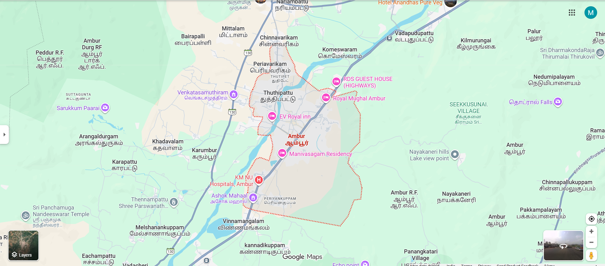

# Ex04 Places Around Me
# Date:08.11.2025
# AIM
To develop a website to display details about the places around my house.

# DESIGN STEPS
## STEP 1
Create a Django admin interface.

## STEP 2
Download your city map from Google.

## STEP 3
Using <map> tag name the map.

## STEP 4
Create clickable regions in the image using <area> tag.

## STEP 5
Write HTML programs for all the regions identified.

## STEP 6
Execute the programs and publish them.

# CODE
```
map.html
<!-- Image Map Generated by http://www.image-map.net/ -->


<map name="image-map">
    <area target="" alt="ambur " title="ambur " href="ambur.html" coords="905,410,990,488" shape="rect">
    <area target="" alt="paarai" title="paarai" href="sarukkum paraai.html" coords="158,309,364,382" shape="rect">
    <area target="" alt="Falls" title="Falls" href="thottraal falls .html" coords="1576,265,1803,373" shape="rect">
    <area target="" alt="hospital" title="hospital" href="km nu hospital.html" coords="637,536,854,604" shape="rect">
    <area target="" alt="Temple" title="Temple" href="Panchamuga Nadeeswarar Temple.html" coords="53,644,303,739" shape="rect">
</map>
ambur.html
<!DOCTYPE html>
<html lang="en">
<head>
    <meta charset="UTF-8">
    <meta name="viewport" content="width=device-width, initial-scale=1.0">
    <title>Document</title>
</head>
<body>
    
    <h1>AMBUR</h1>
    
</body>
</html>
km nu hospital.html
<!DOCTYPE html>
<html lang="en">
<head>
    <meta charset="UTF-8">
    <meta name="viewport" content="width=device-width, initial-scale=1.0">
    <title>Document</title>
</head>
<body>
    
    <h1>Km Nu hospital</h1>
    
</body>
</html>
sarukkum parrai.html
<!DOCTYPE html>
<html lang="en">
<head>
    <meta charset="UTF-8">
    <meta name="viewport" content="width=device-width, initial-scale=1.0">
    <title>Document</title>
</head>
<body>
    
    <h1>sarukkum paarai</h1>
    
</body>
</html>
Panchamuga Nadeeswarar Temple
<!DOCTYPE html>
<html lang="en">
<head>
    <meta charset="UTF-8">
    <meta name="viewport" content="width=device-width, initial-scale=1.0">
    <title>Document</title>
</head>
<body>
    
    <h1>Panchamuga Nadeeswarar Temple</h1>
    
</body>
</html>
thottraal falls.html
<!DOCTYPE html>
<html lang="en">
<head>
    <meta charset="UTF-8">
    <meta name="viewport" content="width=device-width, initial-scale=1.0">
    <title>Document</title>
</head>
<body>
    
    <h1>thottraal Falls</h1>
    
</body>
</html>
```
# OUTPUT

.png>)
.png>)
.png>)
.png>)
.png>)


# RESULT
The program for implementing image maps using HTML is executed successfully.
